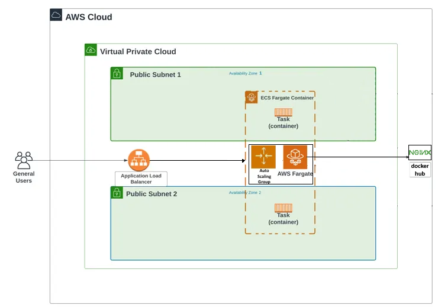

# This Terraform module provisions a Dockerized API service with Auto Scaling Group and Load Balancer.
## Structure:
```
dockerized-API-with-ASG-LB-module/
└── main.tf
```
## AWS Architecture Diagram :
 <br/>

## Terraform Provision Steps:
1. Set up **Docker**: 
    -   Setting up *Docker provider* in *Terraform Configuration*.
2. Set up **AWS** Cloud:
    -   Setting up *AWS provider* in *Terraform Configuration*.
    -   Set your **AWS configuration** with your *IAM user SSH key* and *region*.
    -   Set up **VPC**.
    -   Set up **Subnets** (public, private).
3. Set up **Load Balancer**:
    > ALB (Application Load Balancer) for distributing traffic among instances in the **ASG**.
    -   Set up **LB Security Group**.
    -   **Load Balancer** *type*: *Application*.
    -   Set up **Target Group**.
    -   Set up **Listener**.
4. Set up **ECS**:
    > ECS (Elastic Container Service) for running Docker containers.
    -   Set up **ECS Security Group**.
    -   Set up **ECS cluster**.
        > This cluster will host your containerized application.
    -   Set up **ECS task definition**:
        > It specify how your containers should run within the **ECS cluster**.
        -   Includes: **Nginx Docker image**, *CPU*, *memory requirements*, *networking configuration*.
    -   Set up **ECS service**.
        > This service runs and maintains your desired number of tasks simultaneously in the **ECS cluster**.
5. Set up **ASG**:
    > ASG (Auto Scaling Group) to adjust the number of instances based on demand.
    -   Set up **Auto Scaling Policy** for **ECS cluster**.
6. **Test** ECS with **Docker Image**:
    -   After ``` $ terraform apply ```, go to the *EC2 console*, navigate to *Target Groups*, and select the **target group** associated with your **ALB**.
    -   Copy *DNS name* and paste it in your web search to check that *NGINX* is running.
7. **Test** scale in and out based on load:
    -   AWS ECS Console: 
        -   Select **cluster** and then the **service**. 
        -   Check the *task status* to see if new tasks are being launched or stopped, indicating scale-out or scale-in actions.
    -   Check Target Group Health: 
        -   Go to the *EC2 console*, navigate to *Target Groups*, and select the **target group** associated with your **ALB**. 
        -   Check the *health status* of the targets to see if new instances are being registered or unhealthy instances are being deregistered.

## Provision Instructions:
-   To use this module in your Terraform configuration, create a *module block* in *main.tf* of your root module and insert the variables:
    ```
    module "<NAME>" {
        # Module
        source = "./dockerized-API-with-ASG-LB-module"
    }
    ```
-   To run this example execute:
    ```
    $ terraform init # installs and updates modules
    $ terraform plan # generates excecution plan
    $ terraform apply # to provision module
    ```
-   To destroy all:
    ```
    $ terraform destroy
    ```

